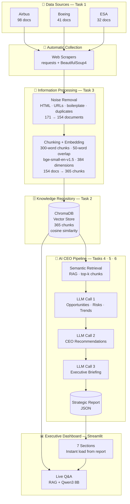
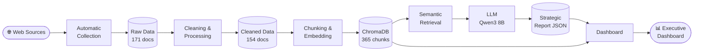
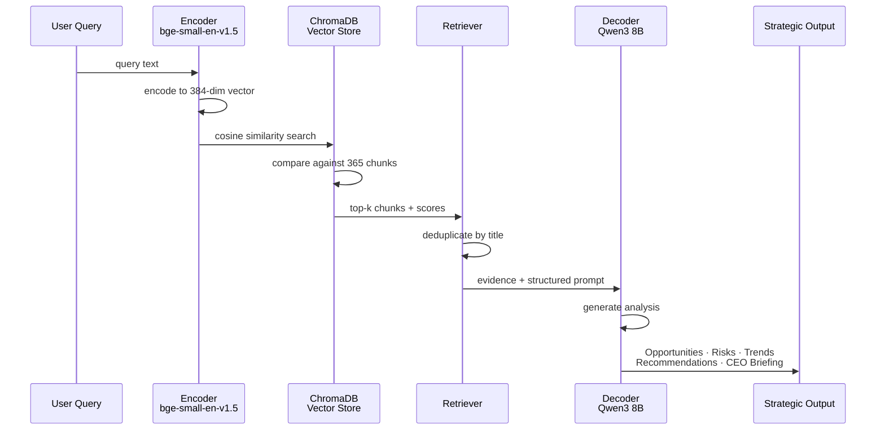
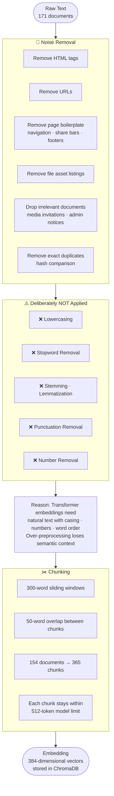

# AI CEO: Strategic Intelligence Agent — Airbus

An AI-powered strategic intelligence system that collects live information about Airbus, processes it through a RAG pipeline, and generates executive-level recommendations answering: **"If you were the CEO today, what would you do next and why?"**

---

## System Architecture



---

## Data Flow Diagram



---

## RAG Pipeline



---

## NLP Preprocessing Pipeline



---

## Technology Stack

| Component | Technology | Why chosen |
|---|---|---|
| Data collection | requests + BeautifulSoup4 | Reliable HTML scraping with retry/backoff |
| Knowledge repository | ChromaDB | Persistent vector store with metadata |
| Embedding model | BAAI/bge-small-en-v1.5 | Encoder-only · 384-dim · recommended in brief |
| LLM | Qwen3 8B via Ollama | Decoder-only · open-source · no paid API |
| Dashboard | Streamlit + Plotly | Interactive · on recommended list |
| Sentiment | VADER | Lexicon-based · fast · no model download |

---

## Key Design Decisions

### Why precompute the report offline?
Qwen3 8B takes ~15 minutes to generate the full report on a laptop. Running it live would freeze the dashboard. The report is generated once in the terminal and saved to JSON. The dashboard reads it instantly. The live Q&A box is the only real-time LLM call.

### Why chunking?
The embedding model has a hard 512-token limit. Long documents would be silently truncated without chunking. 300-word chunks with 50-word overlap ensure every part of every document is fully searchable. Result: 154 documents → 365 chunks.

### Why no stopword removal or lemmatization?
Transformer embeddings are trained on natural text and rely on word order, casing, and stopwords to understand meaning. Removing them degrades retrieval quality — the "over-preprocessing" pitfall from the course slides. Numbers like A350-1000 and €73.4bn carry critical domain meaning.

### Why three LLM calls instead of one?
A single prompt with all instructions plus all evidence plus all output templates exceeds the model's output token limit and gets cut off. Three focused calls (intelligence → recommendations → briefing) each produce complete, untruncated output.

### Why cosine similarity?
Cosine similarity measures the angle between vectors — it captures semantic similarity regardless of document length. A short chunk and a long chunk about the same topic score equally similar, unlike Euclidean distance which penalises shorter vectors.

### Why score sentiment on titles not full text?
VADER accumulates positive word counts over long text. A 3,000-word press release scores 0.96 (maximum positive) even when factually neutral. Titles (10–15 words) give a realistic 26% positive / 67% neutral / 7% negative distribution.

---

## How to Run

```bash
# 1. Install dependencies
pip install -r requirements.txt

# 2. Install Ollama and pull the model
# Download from https://ollama.com
ollama pull qwen3:8b

# 3. Build the knowledge base
python main.py

# 4. Generate the strategic report (one-time, ~15 min)
python sources/strategic_report.py

# 5. Launch the dashboard
streamlit run sources/streamlit_app.py
```

---

## Data Sources

| Source | Category | Documents |
|---|---|---|
| Airbus Newsroom | Company Source | ~98 |
| Boeing Newsroom | Market / Competitor Source | 41 |
| ESA Newsroom | Research / Industry Source | 32 |
| **Total** | | **171 raw → 154 cleaned** |

---

## Key Numbers

| Metric | Value |
|---|---|
| Raw documents collected | 171 |
| After cleaning | 154 |
| Chunks in ChromaDB | 365 |
| Chunk size | 300 words |
| Chunk overlap | 50 words |
| Embedding dimensions | 384 |
| Model token limit | 512 |
| LLM parameters | 8 billion |
| LLM context window | 4096 tokens |
| LLM calls per report | 3 |
| Dashboard sections | 7 |
